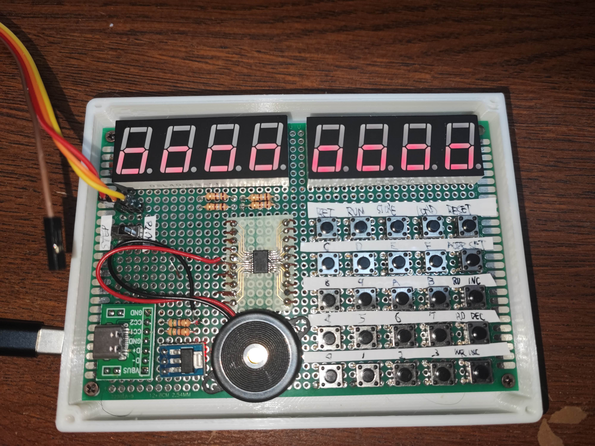
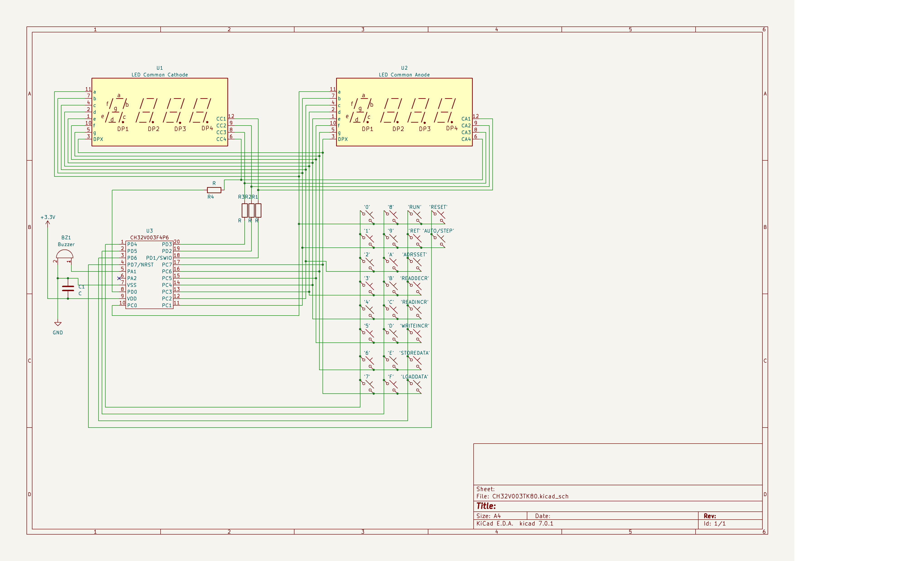
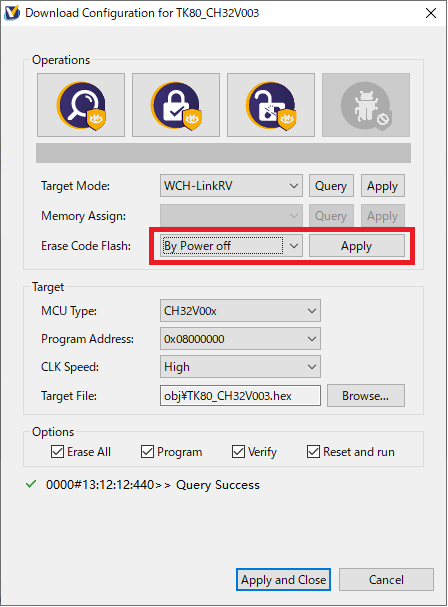
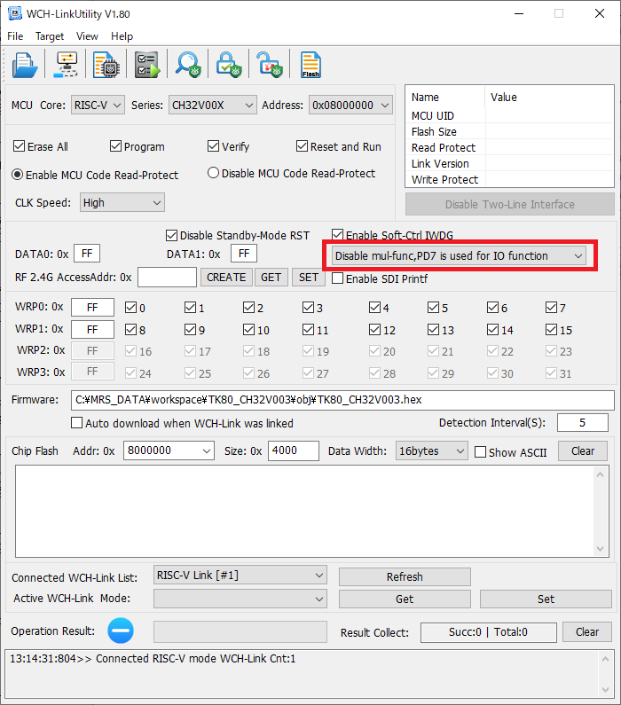

# TK-80 Emulator for CH32V003

いにしえの NEC TK-80 を CH32V003 で再現してみました。
メモリは 8000h から 83ffh までの 1KiB を実装しています。<br>



マイコンに書き込む際には下記の PD7 の注意書きにしたがって、NRST 機能をオフにしてください。<br>
tk80rom.h の中に ROM のデータ(768B)が必要です。<br>

8080 のエミュレーションには[https://github.com/superzazu/8080](https://github.com/superzazu/8080)
を使用しています。Intel 純正 8080 をエミュレートしていますので、NEC版 8080A 固有命令は実行できません。
(そういう意味では TK-80E エミュレータというべきか)
速度は実機の 1/3 くらいです。<br>

8255 は手抜き実装ですので、コントロールワードのモード設定がダミーになっています。
モード設定にかかわらず OUT で出力、IN で入力されます。<br>
ブザーは ポートC の PC1 で制御できます。

## 回路について

外付け IC を使ったら負けという思想に基づき、
マイコンだけでなんとかします。<br>
回路については[電子ブロック工房さんの ZK-80 mini](https://www.recfor.net/blog/mycom/?itemid=883)
を参考にさせていただきました。



GPIO 一本で、最大 8 個の LED をドライブするので、全体的に暗いです。
またLED が完全に消灯できないようなので、ちょっとゴーストっぽい表示が出ます。<br>
素直に 74HC595 あたりを使った方が実用的ですね。
(マイコンよりも 595 の方が高いんだが…)

## セーブ&ロード

STORE DATA / LOAD DATA で内蔵フラッシュに 1KiB RAM 全体をセーブ＆ロードします。<br>
セーブアドレスの指定や、ロード後の実行アドレスの自動設定には対応していません。<br>
純正 ROM の SAVE/LOAD ルーチンのアドレスでフックしていますので、アドレスが異なる ROM を使う場合には修正が必要です。

---

# CH32V003 で GPIO を目一杯つかうには

ここでは18本ある GPIO のうち、17本を使用しています。<br>
うち何本かは使用するのに細工が必要です。<br>

## PD1 (SWIO) を GPIO として使う

PD1 はデフォルトでは SWIO として使われているので、そのままでは GPIO としてつかえません。
以下の方法で SWIO の機能を停止させることができます。

```
    RCC_APB2PeriphClockCmd( RCC_APB2Periph_AFIO, ENABLE);
    GPIO_PinRemapConfig(GPIO_Remap_SDI_Disable, ENABLE);
```

SWIO の機能を停止させると、そのままではフラッシュへ書き込みできなくなりますので、
以下の方法で一旦フラッシュをクリアする必要があります。<br>




## PD7 (NRST) を GPIO として使う

PD7 は書き込みツールのデフォルトで NRST 機能がオンになっているので、そのままでは GPIO として使えません。
フラッシュの末尾のユーザエリアに PD7 に NRST をマッピングするかどうか設定する場所があります。
簡単に設定するならWCH Link Utility を使って以下の場所を変更します。<br>



## PA1/PA2 (クロック入力) を GPIO として使う

`system_ch32v00x.c` で、内部クロック(HSI)の設定にするとそのまま GPIO として使うことができます。
PD1/PD7 と違って HSE 設定時に明示的にクロック入力をオンにしているので、オンにしなければそのままです。<br>
